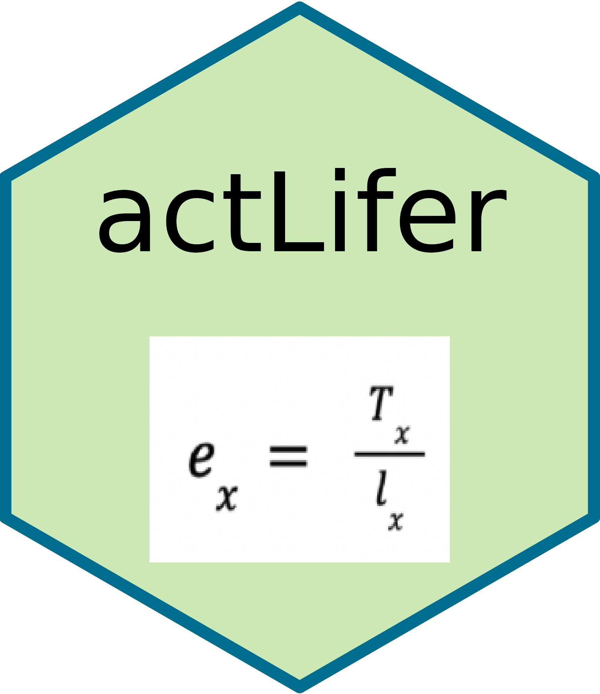

<!-- README.md is generated from README.Rmd. Please edit that file -->

```{r, include = FALSE}
knitr::opts_chunk$set(
  collapse = TRUE,
  comment = "#>",
  fig.path = "man/figures/README-",
  out.width = "100%"
)
```

# act)lifer


<!-- badges: start -->
[](https://github.com/g-rade/actLifer/actions/workflows/R-CMD-check.yaml)
<!-- badges: end -->


The `actLifer` package contains functions that create a life table based on mortality data, and ultimately calculates life expectancy from data on annual deaths for given ages/age groups. This package also contains mortality data from CDC wonder. 

This package will be useful for actuaries, epidemiologists, or any data scientists working with mortality data.


## Installation

You can install the development version of actLifer from [GitHub](https://github.com/) with:

``` r
# install.packages("devtools")
devtools::install_github("g-rade/actLifer", build_vignettes=TRUE)
```

You can install the released version of actLifer from CRAN:

```{r}
# install.packages("actLifer")
```

## How To Use 'actLifer'
```{r}
library(actLifer)

## Take a look at the mortality2 data fram
head(mortality2)


## Use the lifetable function to make a custom life table with just
## CentralDeathRate, PropToSurvive, and LifeExpectancy by setting includeAllSteps = FALSE

lifetable(mortality2, "age_group", "population", "deaths", FALSE, TRUE, TRUE)


## Or show everything by setting includeAllSteps=TRUE, includeCDR=TRUE, and includePS=TRUE which are the default values
lifetable(mortality2, "age_group", "population", "deaths")
```


## Contributors

  + [Grace Rade](https://github.com/g-rade)
  + [Maeve Tyler-Penny](https://github.com/mctp546)
  + [Julia Ting](https://github.com/jtingy)
