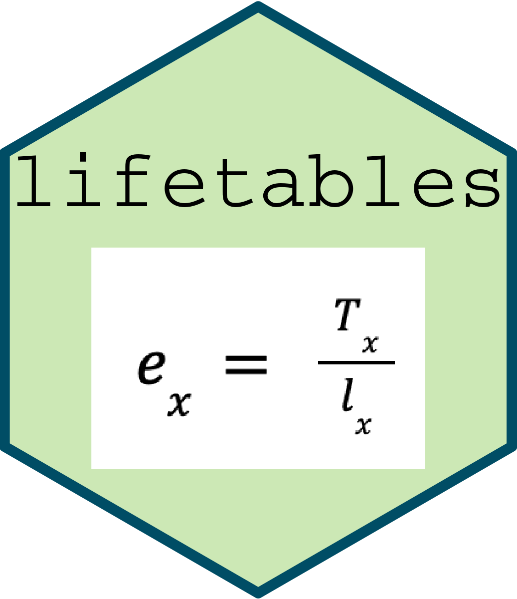

```{r, include = FALSE}
knitr::opts_chunk$set(
  collapse = TRUE,
  comment = "#>"
)
```

### Grace Rade, Maeve Tyler-Penny, Julia Ting

```{r setup}
library(lifetables)
```

{width=30%}

The lifetables package contains functions to create actuarial life tables and three datasets ready to be made into a life table. Each mathematical step in transforming mortality data into life expectancy has a corresponding function, which builds the table up to that step. The datasets have been prepared are are ready to use in our functions. 

## Inspiriation

This package was inspired by a research experience. Grace was assisting a professor in gathering state-level life expectancy data for different racial-sex groups. While nationwide life expectancy data is published by the CDC annually, state-level life expectancy is incredibly difficult to find, for both statewide populations and demographic subgroups. However, mortality data is widely available through state government reports and the CDC Wonder Database. 

Mathematically speaking, mortality data is the first step in calculating life expectancy. There are several intermediate calculations between the number of deaths at a given age and life expectancy, and each step builds on the previous values. With this in mind, we created several functions that calculated each intermediate value that build a complete actuarial lifetable when combined. Lifetables can be rather easily created in a spreadsheet, but is a rather involved process in R. Our functions simplify the procedure of creating a lifetable into one function with the option to group by different categorical variables.  

The lifetables package is a useful tool for anyone who works with mortality data, wants to calculate life expectancy, or wants to find any of the intermediate values between number of deaths and life expectancy. 

## Functions

All of the functions take in a dataset that has columns for age group ($x$), deaths at each age ($D_x$), and the midyear population at each age ($P_x$). 

* `central_death_rate()`: Calculates the central/crude death rate, $M_x$, which is the number of deaths in a given period divided by the population at risk in that same given period. 

  + Formula: $M_x = \frac{D_x}{P_x}$
  
  + This is an optional column in the lifetable, but can be useful to ascertain a general indication of the health status of a given area or population. 
  
* `conditional_death_prob()`: Calculates the conditional probability of death at each age ($q_x$), which is the probability of dying at a certain age within a given period. 

  + Formula: $q_x = \frac{D_x}{P_x + \frac{D_x}{2}}$

  
* `conditional_life_prob()`: Calculates the conditional prbability of life at each age ($p_x$), which is the probability of living to a certain age within a given period. 

  + Formula: $p_x = 1 - q_x$

*please note that R will round the conditional probability of life to 1, this will not present problems to later calculations*
  
* `number_to_survive()`: Calculates the number of people to survive to a given age interval ($l_x$), starting with an arbitrary number of 100,000 at age 0 (or age < 1).

  + Formula: $l_x = l_{x-1} \cdot p_{x-1}; l_0 = 100,000$

* `prop_to_survive()`: Calculates the proportion of the population surviving to age $x$. 

  + Formula: $l_x/100000$
  
  + This is another optional column in the lifetable

* `person_years()`: Calculates the person years lived at each age (), which is the total number of years lived at each age $x$ by all people who survive to that age. 

  + Formula: $ L_x = \frac{l_x + l_{x+1}}{2}$
  
* `total_years_lived()`: Calculates the total years lived to each age $x$, which is the sum of all person years from $0$ to age $x$. 

  + Formula: $T_x = \sum_{i = 0}^{x}L_x$

* `life_expectancy()`: Calculates the life expectancy at age $x$ ($e_x$), which is the number of years an average person is expected to live beyond their current age. 

  + Formula: $e_x = \frac{T_x}{l_x}$
  
  + This function will output a complete life table, without the added customization of the `lifetable()` function. 
  
* `lifetable()`: Outputs a complete lifetable with the ability to customize which of the optional columns are included, and add extra grouping variables. 

  + if `includeAllSteps = TRUE`, the lifetable will include `CentralDeathRate` and `PropToSurvive` in the final output
  
  + if `includeCDR = FALSE`, `CentralDeathRate` will not be included in the final output
  
  + if `includePS = FALSE`, `PropToSurvive` will not be included in the dataset
  
  + `includeAllSteps`, `includeCDR`, and `includePS` are all `TRUE` by default
  
```{r}
head(lifetable(mortality2, age_group, population, deaths))
```


## Datasets

The package includes three datasets, all sourced from the CDC Wonder Database. 

+ `mortality` contains data from the year 2016 with multi-year age groups

+ `mortality2` contains data from the year 2016 with single-year age gaps

+ `mortality3` contains data from the year 2016 with single-year age gaps and a gender grouping variable


### What Do These Datasets Look Like?

Each of the included data sets include an age group variable, a population variable, and a deaths variable. Population represents the mid-year population for each age group. Deaths represents the number of people in each age group that have died. 

Here's what the first five rows of `mortality2` look like. 

```{r}
head(mortality2)
```

